```python
from IPython.display import HTML

HTML('''<script>
code_show=true; 
function code_toggle() {
 if (code_show){
 $('div.input').hide();
 } else {
 $('div.input').show();
 }
 code_show = !code_show
} 
$( document ).ready(code_toggle);
</script>
<form action="javascript:code_toggle()"><input type="submit" value="Click here to toggle on/off the raw code."></form>''')
```


<script>
code_show=true; 
function code_toggle() {
 if (code_show){
 $('div.input').hide();
 } else {
 $('div.input').show();
 }
 code_show = !code_show
} 
$( document ).ready(code_toggle);
</script>
<form action="javascript:code_toggle()"><input type="submit" value="Click here to toggle on/off the raw code."></form>


# BICYCLE SHARING DEMAND PREDICTOR

## INTRODUCTION

In this project report, I will discuss the steps taken to develop a predictive model to forcast counts of hourly bicycle rental in Washington D.C. The model will be built by combining historical usage patterns with weather data. The dataset used in this project is part of the kaggle competition dataset collection. 

The data is comprised of information collected over the first 19 days of each month. There are 10886 observations and 12 columns. A description of the columns are provided below:

Data Fields

- datetime - hourly date + timestamp  
- season -  1 = spring, 2 = summer, 3 = fall, 4 = winter 
- holiday - whether the day is considered a holiday. 0: Not a holiday, 1: Is a holiday
- workingday - whether the day is neither a weekend nor holiday. 0: Not a working day, 1: Is a working day
- weather - 1: Clear, Few clouds, Partly cloudy, Partly cloudy,  
2: Mist + Cloudy, Mist + Broken clouds, Mist + Few clouds, Mist,  
3: Light Snow, Light Rain + Thunderstorm + Scattered clouds, Light Rain + Scattered clouds,  
4: Heavy Rain + Ice Pallets + Thunderstorm + Mist, Snow + Fog 
- temp - temperature in Celsius
- atemp - "feels like" temperature in Celsius
- humidity - relative humidity
- windspeed - wind speed
- casual - number of non-registered user rentals initiated
- registered - number of registered user rentals initiated
- count - number of total rentals

The categorical variables such as: season, holiday, working day and weather have been encoded, and given integer codes. The target variable is count.


### Load Required Packages

Loaded the required packages for this project. Packages from sklearn were useful for processing, machine learning, and model evaluation. Matplotlib and seaborn were useful for plotting and scipy was usefule for statistics.


```python
## Load the required packages
import pandas as pd
import numpy as np
import random
from scipy import stats
import matplotlib.pyplot as plt
import matplotlib.patches as mpatches
import seaborn.apionly as sns
from sklearn.model_selection import train_test_split
from pandas.tools.plotting import scatter_matrix
from sklearn.linear_model import LinearRegression
from sklearn.ensemble import GradientBoostingRegressor
from sklearn.tree import DecisionTreeRegressor
from sklearn.ensemble import RandomForestRegressor
from sklearn.metrics import explained_variance_score
from sklearn.metrics import mean_absolute_error
from sklearn.metrics import mean_squared_error
from sklearn.metrics import median_absolute_error
from sklearn.metrics import r2_score
% matplotlib inline
```

### Load Dataset

I loaded in the data set from a local file.


```python
## Read in the data
pd.set_option('display.max_columns' , 40)
bicycle = pd.read_csv("/Users/oofoegbu/Datasets/bicycle_train.csv")
```

## DATA CLEANING

I noticed from the summary of the dataset that the target variable 'count', is the exact sum of the variables 'casual' and 'registered'. So 'casual' and 'registered' are not independent variables and thus will not be required in the predictor model.


```python
## Droping non-independent variables
bicycle = bicycle.drop(['casual', 'registered'], 1) 
```

### Features Engineering

Currently the datetime variable is in the format YYYY-MM-DD HH:MM:SS, which is not a very useful format for exploring the effect of time on bicycle rental. To make it more useful I converted it to several time variables.

The datetime variable has been converted to:
- year: 2011, 2012
- month: Jan = 1, Dec = 12
- day: 1 to 19
- hour: 0 to 23
- day of week: Monday = 0, Sunday = 6
- weekday: Monday - Friday = 0, Saturday - Sunday = 1


```python
## Decomposing datetime variable to year, month, hour and day of the week
bicycle['year'] = pd.DatetimeIndex(bicycle['datetime']).year
bicycle['month'] = pd.DatetimeIndex(bicycle['datetime']).month
bicycle['day'] = pd.DatetimeIndex(bicycle['datetime']).day
bicycle['hr_of_day'] = pd.DatetimeIndex(bicycle['datetime']).hour 
bicycle['day_of_week'] = pd.DatetimeIndex(bicycle['datetime']).dayofweek 
bicycle['weekday'] = ((pd.DatetimeIndex(bicycle['datetime']).dayofweek) // 5 == 1).astype(float)

bicycle = bicycle.drop('datetime', 1)
bicycle = bicycle[['season','holiday','workingday','weather','temp','atemp','humidity','windspeed','year','month','day','hr_of_day','day_of_week','weekday','count']]
```

### Split dataset into training, validation and testing set

I wil be using data from the first 13 days of each month to train the model. Data from the 14th to 19th day of each month will be used to test the accuracy of the model prediction.

    The training set is comprised of 5961 observations 
    The validation set is comprised of 1491 observations
    The testing set is comprised of 3434 observations


```python
## Use only data from the first 13 days of each month to train the model
train = bicycle.loc[bicycle['day'] < 14]
## Remove 'day'. It is not a predicting feature 
train = train.drop('day', axis = 1)
## Splitting the validation set into val and test set
training, val = train_test_split(train, test_size = 0.2, random_state = 19)

## testing set will contain data from the 14 to 19th of each month
test = bicycle.loc[bicycle['day'] >= 14]
test = test.drop('day', axis=1)
```

## EXPLORATORY ANALYSIS

My goal in exploration is to better understand the nature of the correlation of each predictor with count of bicycle rental. Below are the questions I propose to address.

   1. What can be deduced from the correlation between the predictors? 
   2. How does holidays affect bicycle rental?
   3. How does the season, month of the year, the hour of the day, if it is a weekday or not, a working day or not, affect count of bicycle rental?
   4. How is bicycle rental affected by weather, temperature, humidity, and windspeed?

### Question 1: What can be deduced from the correlation between the predictors?

To identify any possible correlation between prediction features, I made a correlation matrix of the predictors. As shown in the matrix below, the following sets of predictors are highly correlated:

1. season and month
2. weekday and working day
3. weekday and day of the week
4. temp and atemp

These correlations are expected, as months can be grouped into seasons, atemp which is what the temperature feels like will depend on what the temperature really is. Also most working days will be weekdays, while most non-working days will be weekends and the days monday through friday are grouped as weekdays while saturday and sunday are weekends.

Due to these correlations, it will be redundant using correlated features in the model. To resolve the issue of multicollinearity, one feature from each pair will be removed from the features list. 


```python
## correlation matrix of prediction features
features = training.drop('count', axis = 1)
features_corr = features.corr()

# plot the heatmap
fig, ax = plt.subplots(figsize=(15,15))
g = sns.heatmap(features_corr, cbar = True, square = True, annot = False, cmap="Set1",
           xticklabels = features_corr.columns.values,
           yticklabels = features_corr.columns.values, ax = ax)

plt.setp(ax.get_xticklabels(), rotation=90)
ax.set_title("Correlation Matrix of Prediction Features", fontsize = 18)


plt.show()
```


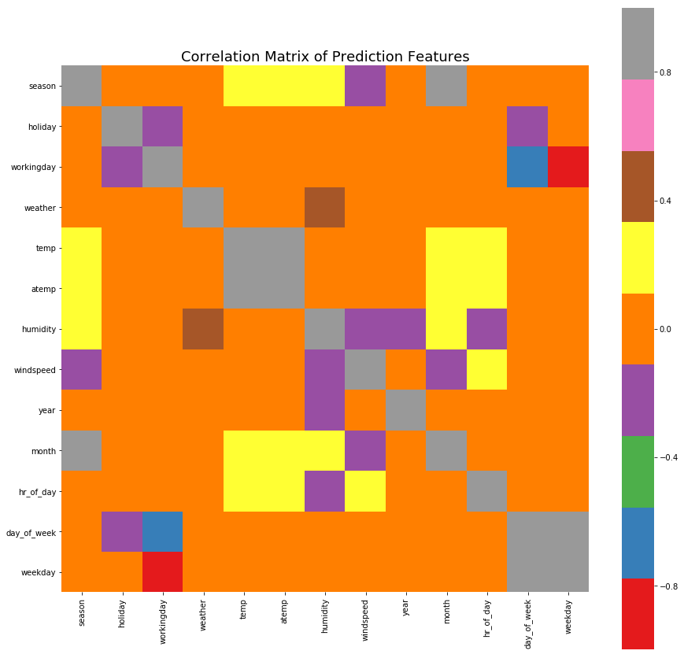


### Question 2: How does holidays affect bicycle rental?

Given that holidays can fall on random days, it is understood why holiday does not show any strong correlation with any other predictor. I will approach this question by visualizing the distribution of bicycle rental count for holidays and non-holidays. 

The violin plot below shows a larger variance in the count distribution on non-holidays than on holidays, with higher counts occurring on non-holidays. T-test on the means indicate a slightly significant difference at a 95% confidence level, in the average count between holidays and non-holidays. However the difference in mean counts is insignificant at a 90% confidence level.

Based on this finding, we can expect a low correlation between holiday and count of bicycle rental.


```python
## violin plot of distribution of count on holidays and non-holidays
fig = plt.figure(figsize=(20, 6))
ax1 = fig.add_subplot(121)
sns.violinplot(x="holiday", y="count", data=training, ax = ax1)
ax1.set_xticklabels(['non-holiday', 'holiday'], fontsize = 16)
ax1.set_xlabel('')
ax1.set_ylabel('Count', fontsize = 16)
ax1.set_title('Distribution of count on holidays and non-holidays', fontsize = 20)
plt.yticks(fontsize=14)

plt.show()
```


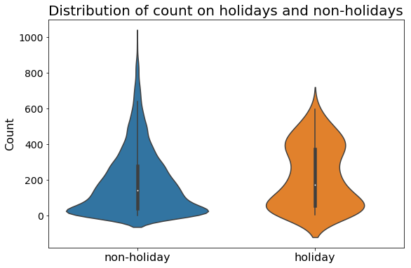


```python
### t-test comparing the mean count of bicycle rental for holidays and non-holidays
a = training[training['holiday'] == 0]['count']
b = training[training['holiday'] == 1]['count']

ttest1 = stats.ttest_ind(a,b, equal_var = False )[1]

print("T-TEST RESULT:")
print("T-test comparing mean count for holidays and non-holidays, results in a p-value = %.3g (which is < 0.05)" %ttest1)
```

    T-TEST RESULT:
    T-test comparing mean count for holidays and non-holidays, results in a p-value = 0.04 (which is < 0.05)


### Question 3: How does the year, season, month of the year, the hour of the day, if it is a weekday or not, a working day or not, affect count of bicycle rental?


First I wil start by exploring the nature of the correlation between season and month, as well as how they affect the count of bicycle rental. To achieve this, I made a bar chart of the average count in each month. The bars have been color coded to indicate the season. 

From the bar chart, we can see that the first quarter of year (i.e. months 1,2&3) are categorized as spring, the 2nd quarter is summer, followed by fall and finally winter. We also observe lower rental in the cooler seasons (i.e. spring and winter) and higher rentals in the warmer seasons (i.e. summer and fall).


```python
## Create dataframe of average count per month grouped by season
Spring = training.loc[training['season'] == 1]
Spring = Spring[['month','count']]
spring_count = pd.DataFrame(Spring.groupby('month').mean().reset_index())
spring_count['season'] = 'spring'

Summer = training.loc[training['season'] == 2]
Summer = Summer[['month','count']]
summer_count = pd.DataFrame(Summer.groupby('month').mean().reset_index())
summer_count['season'] = 'summer'

Fall = training.loc[training['season'] == 3]
Fall = Fall[['month','count']]
fall_count = pd.DataFrame(Fall.groupby('month').mean().reset_index())
fall_count['season'] = 'fall'

Winter = training.loc[training['season'] == 4]
Winter = Winter[['month','count']]
winter_count = pd.DataFrame(Winter.groupby('month').mean().reset_index())
winter_count['season'] = 'winter'

avg_count_month = spring_count.append(summer_count)
avg_count_month = avg_count_month.append(fall_count)
avg_count_month = avg_count_month.append(winter_count).reset_index(drop = True)
```


```python
## Plot the average count for each month, color coded by season
fig, ax = plt.subplots(figsize=(10,8))

colors = {'spring':'blue','summer':'red','fall':'green','winter':'black'}
ax.bar(avg_count_month['month'], avg_count_month['count'], color=avg_count_month['season'].apply(lambda x: colors[x]))
ax.set_xlabel('Month', fontsize = 16)
ax.set_ylabel('Average Count', fontsize = 16)
ax.set_title('Average count for each month', fontsize = 20)
plt.xticks(fontsize=14)
plt.yticks(fontsize=14)

## Add customized legend
Spring = mpatches.Patch(color='blue', label='Spring')
Summer = mpatches.Patch(color='red', label='Summer')
Fall = mpatches.Patch(color='green', label='Fall')
Winter = mpatches.Patch(color='black', label='Winter')
plt.legend(handles=[Spring,Summer,Fall,Winter], loc=2, fontsize = 14)

plt.show()
```


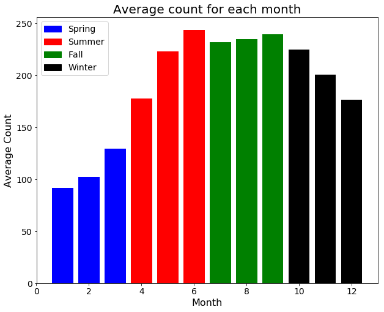


Next, I have used boxplots to visualize the distribution of bicycle rental count between the years 2011 and 2012, as well as hours of the day. 

The first plot shows increase in the mean count of bicycle rental from 2011 to 2012. This increase suggests a rising interest in bicycle sharing program. I used t-tests to check the significant in the difference in mean counts for the groups by year. A p-value of 7.15E-95 implies that at a 95% significance level, I fail to accept the null in favor of the alternative, that there is a significant difference in mean count between the years 2011 and 2012.

The second plot showing count grouped by hr of day, shows higher counts of bicycle rental between the hours of 7am and 8pm, with two significant peaks around 8am and 5pm. The hours of 7am and 8pm are working hours so we expect more people out and about during those hours. The two significant peaks coincide with start and end of the work day, so it could be people commuting to and from work. 


```python
fig = plt.figure(figsize=(18, 6))
ax1 = fig.add_subplot(121)
year_count = training[['year','count']]
year_count.boxplot(by = 'year', ax = ax1, patch_artist=True)
ax1.set_title('Count Grouped by Year', fontsize = 20)
ax1.set_ylabel('COUNT', fontsize = 16)
ax1.set_xlabel('YEAR', fontsize = 16)
ax2 = fig.add_subplot(122)
hr_of_day_count = training[['hr_of_day','count']]
hr_of_day_count.boxplot(by = 'hr_of_day', ax = ax2, patch_artist=True)
ax2.set_title('Count Grouped by Hr of Day',fontsize = 20)
ax2.set_ylabel('COUNT', fontsize = 16)
ax2.set_xlabel('HOUR OF DAY', fontsize = 16)
fig.suptitle('')

plt.show()
```


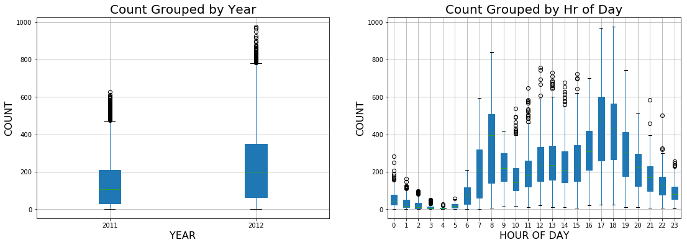


```python
### t-test comparing the mean count of bicycle rental for the different years
a = training[training['year'] == 2011]['count']
b = training[training['year'] == 2012]['count']

ttest1 = stats.ttest_ind(a,b, equal_var = False )[1]

print("T-TEST RESULT:")
print("T-test comparing mean count in 2011 to mean count in 2012, results in a p-value = %.3g (which is < 0.05)" %ttest1) 
```

    T-TEST RESULT:
    T-test comparing mean count in 2011 to mean count in 2012, results in a p-value = 7.15e-95 (which is < 0.05)


I used the violin plots below to visualize the distribution of count between weekday and weekends, and also between working and non-working days. The plots indicate that the highest count of bicycle rental occur on week days and working days, however; there are only a few occurences of such high counts thus the narrow peaks in the plots. 

Despite higher counts on weekdays and working day, t-tests to compare the means count indicated that no significant difference in the mean count of bicycle rental between working days and non-working days at a 95% confidence level. At a 95% confidence level, there is no significant difference in the mean count between weekday and weekend,however, it is significant at a 90% confidence level, with count decreasing from weekday to weekend. The t-tests results suggests that people make use of the bicycle sharing program but as a means of commuting to work and also for leisure.  


```python
fig = plt.figure(figsize=(20, 6))
ax1 = fig.add_subplot(121)
sns.violinplot(x="weekday", y="count", data=training, ax = ax1)
ax1.set_xticklabels(['weekday', 'weekend'], fontsize = 16)
ax1.set_xlabel('')
ax1.set_ylabel('Count', fontsize = 16)

ax2 = fig.add_subplot(122)
sns.violinplot(x="workingday", y="count", data=training, ax = ax2)
ax2.set_xticklabels(['non-working day', 'working day'], fontsize = 16)
ax2.set_xlabel('')
ax2.set_ylabel('Count', fontsize = 16)


plt.show()
```


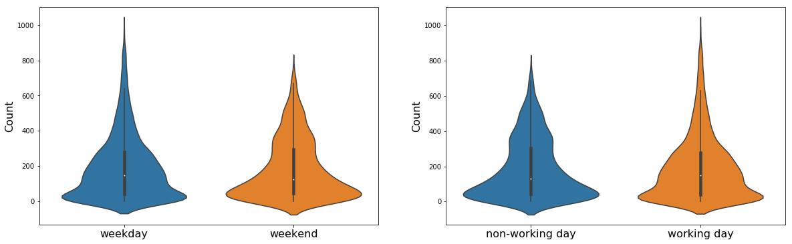


```python
### t-test comparing the mean count of bicycle rental during weekdays and weekends
c = training[training['weekday'] == 0]['count']
d = training[training['weekday'] == 1]['count']

ttest2 = stats.ttest_ind(c,d, equal_var = False )[1]

### t-test comparing the mean count of bicycle rental during working days and non-working days
e = training[training['workingday'] == 0]['count']
f = training[training['workingday'] == 1]['count']

ttest3 = stats.ttest_ind(e,f, equal_var = False )[1]

print("T-TEST RESULTS:")
print("T-test comparing mean count on weekdays and weekends, results in a p-value = %.3g (which is > 0.05)" %ttest2)
print("T-test comparing mean count on workingdays and non-working days, results in a p-value = %.3g (which is > 0.05)" %ttest3)


```

    T-TEST RESULTS:
    T-test comparing mean count on weekdays and weekends, results in a p-value = 0.0627 (which is > 0.05)
    T-test comparing mean count on workingdays and non-working days, results in a p-value = 0.286 (which is > 0.05)


Based on the idea that bicycle rental is used for commute on weekday and working days and for leisure on weekends and non-working days, I think it would be worth exploring the interaction between hour of the day and weekday, and its effect on bicycle rental count. 

The plot below shows mean count with hr of day, for weekdays and weekends. The plot shows different patterns for weekends and weekdays. The blue line representing weekdays shows the peak rental times at 8am and 5pm as discussed earlier. We also see a slight peak at 12 noon which would be lunch time. The green line representing weekend shows a gradual rise from the early hours, peaking in the mid day hours and gradually decreasing. The weekend pattern can possibly be explained by people going on lesiure rides in the middle of the day. Not much commute to and from work during the weekends could explain the absence of the peaks observed on weekdays. I then conclude that there is an interaction between hr_of day and weekday.


```python
## plot showing interaction of hour of day with weekday
fig = plt.figure(figsize=(20, 6))
ax1 = fig.add_subplot(121)
sns.pointplot(x="hr_of_day", y="count",data=training, hue = 'weekday', ax = ax1)
ax1.set_title('Plot showing interaction of hour of day with weekday', fontsize = 16)
ax1.set_xlabel('Hour of day',fontsize = 16)
ax1.set_ylabel('Mean Count',fontsize = 16)

## Add legend
weekday = mpatches.Patch(color='blue', label='weekday')
weekend = mpatches.Patch(color='orange', label='weekend')
plt.legend(handles=[weekday,weekend], loc=2, fontsize = 14)

plt.show()
```


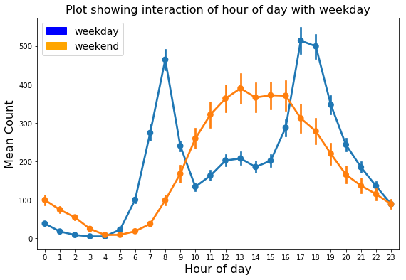


### Question4: How is bicycle rental affected by weather, temperature, humidity, and windspeed?

I will start with the effect of weather on bicycle rental. Recall the weather has been numerically encoded according to the following description:
    
    weather - 1: Clear, Few clouds, Partly cloudy, Partly cloudy,
              2: Mist + Cloudy, Mist + Broken clouds, Mist + Few clouds, Mist,
              3: Light Snow, Light Rain + Thunderstorm + Scattered clouds, Light Rain + Scattered clouds,
              4: Heavy Rain + Ice Pallets + Thunderstorm + Mist, Snow + Fog
              
It is expected that clear skys would be more conducive for riding, and as the weather conditions change to rainy and foggy, riding would be challenging. To visualize the effect of weather on bicycle rental, I made a kernel density plots of count for each weather label. The plot does not include a density plot for weather label 4 because no rental was recorded at the weather condition. As seen in the density plot, the count of bicycle rental decreases as the weather changes from 1 to 3. 

To test the significance of this observation, I used t-tests to compare the means count between the different weather labels. The t-tests result shown below indicate that at a 95% confidence level, there is significant difference between the mean count of bicycle rental of each weather label. This validates my observation that bicycle rental decrease as as the weather changes from 1 to 3.


```python
## Subsets of training data for each weather label
weather_1 = training.loc[training['weather'] == 1]
weather_2 = training.loc[training['weather'] == 2]
weather_3 = training.loc[training['weather'] == 3]
weather_4 = training.loc[training['weather'] == 4]

x1 = weather_1['count']
x2 = weather_2['count']
x3 = weather_3['count']
x4 = weather_4['count']
```


```python
## Kernel density plot of count distribution in different weather conditions.
fig = plt.figure(figsize=(20, 6))
x1.plot(kind="kde")
x2.plot(kind="kde")
x3.plot(kind="kde")
plt.xlabel('Count of Bicycle Rental', fontsize = 16)
plt.ylabel('Density', fontsize = 16)
plt.xticks(fontsize=14)
plt.yticks(fontsize=14)

## Add legend
weather_1 = mpatches.Patch(color='blue', label='Weather = 1')
weather_2 = mpatches.Patch(color='orange', label='Weather = 2')
weather_3 = mpatches.Patch(color='green', label='Weather = 3')
plt.legend(handles=[weather_1, weather_2, weather_3], loc=2, fontsize = 14)

plt.show()
```


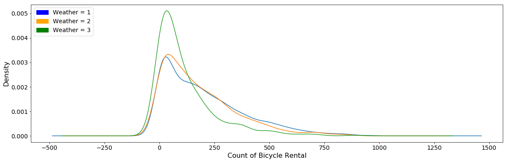


```python
### t-test comparing the mean count of bicycle rental for the different weather types
g = training[training['weather'] == 1]['count']
h = training[training['weather'] == 2]['count']

ttest4 = stats.ttest_ind(g,h, equal_var = False )[1]

i = training[training['weather'] == 1]['count']
j = training[training['weather'] == 3]['count']

ttest5 = stats.ttest_ind(i,j, equal_var = False )[1]

k = training[training['weather'] == 2]['count']
l = training[training['weather'] == 3]['count']

ttest6 = stats.ttest_ind(k,l, equal_var = False )[1]

print("T-TEST RESULTS:")
print("T-test comparing mean count for weather label 1 and 2, results in a p-value = %.3g (which is < 0.05)" %ttest4)
print("T-test comparing mean count for weather label 1 and 3, results in a p-value = %.3g (which is < 0.05)" %ttest5)
print("T-test comparing mean count for weather label 2 and 3, results in a p-value = %.3g (which is < 0.05)" %ttest6)


```

    T-TEST RESULTS:
    T-test comparing mean count for weather label 1 and 2, results in a p-value = 3.75e-05 (which is < 0.05)
    T-test comparing mean count for weather label 1 and 3, results in a p-value = 1.09e-35 (which is < 0.05)
    T-test comparing mean count for weather label 2 and 3, results in a p-value = 9.87e-19 (which is < 0.05)


Next, I used scatter plots to visualize the correlation of temperature, humidity and windspeed with the count of bicycle rental. Given that the features temp and atemp are strongly correlated, in exploring the effect of temperature, I will be using the feature atemp because it measures what the temperature feels like, which is more important to a rider, than the actual temperature. 

None of the plots show strong correlations with count; however, the plot for temperature versus count shows higher counts at higher temperatures. This observation lends support to the observed effect of weather and month discussed earlier. Colder months, and colder weather types showed lower bicycle rental. 

The plot of humidity versus count shows higher counts at lower humidity. This observation also lends support to the observed effect of weather discussed earlier. Weather types with higher precipitation (i.e. higher humidity) had lower bicycle rental.

The plot of windspeed versus count shows fewer counts at windspeed above 30, but I cannot see a good correlation. I will re-evaluate its importance when developing the prediction models.


```python
## Scatter plots of correlation of temperature, humidity and windspeed
fig = plt.figure(figsize=(20, 6))
ax = fig.add_subplot(131)
ax.scatter(training['atemp'],y = training['count'])
ax.set_xlabel('atemp', fontsize = 16)
ax.set_ylabel('count', fontsize = 16)
ax.set_title('Scatter plot of Temperature versus Count', fontsize = 20)
ax2 = fig.add_subplot(132)
ax2.scatter(training['humidity'],y = training['count'])
ax2.set_xlabel('humidity', fontsize = 16)
ax2.set_ylabel('count', fontsize = 16)
ax2.set_title('Scatter plot of Humidity versus Count', fontsize = 20)
ax3 = fig.add_subplot(133)
ax3.scatter(training['windspeed'],y = training['count'])
ax3.set_xlabel('windspeed', fontsize = 16)
ax3.set_ylabel('count', fontsize = 16)
ax3.set_title('Scatter plot of Windspeed versus Count', fontsize = 20)
plt.show()
```


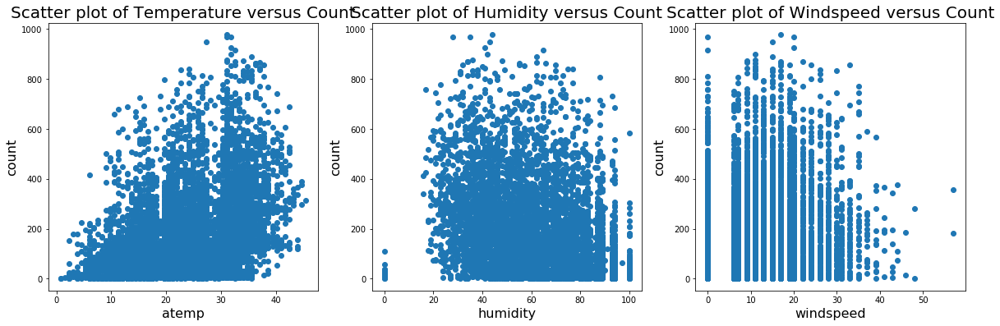


To summarize my finding from the exploratory analysis, the bicycle sharing program shows signs of increase in popularity over the years. As expected seasons and weather conditions affect the number of bicycle rented, with lower rental counts being observed in cooler seasons/months and wet/foggy condition. It is good to see that the bicycle are being used both to commute to and from work, and for leisure. As a result, on average equal count of rental can be expected regardless of working or non-working day, however; a change in the hourly rental count should be expected.

## DEVELOP PREDICTION MODELS

Now that I have gained a better understanding of my data, I will proceed with building the prediction model. Recall, the goal is to build a prediction model that forcasts hourly count of bicycle rental using historical usage pattern and weather data.


### Features selection

I have explored the effect of the features on the count of bicycle rental. Now, I will remove features that I do not consider would add value to the model. I used a correlation matrix, to help determine which features have near zero correlation with the target variable 'count'.

From the correlation matrix below, features holiday, workingday, windspeed, day_of_week and weekday have near zero correlation with the target count. My exploration also showed no effect of the feature holiday on count, so I will remove 'holiday' from the features list. Since weekday is strongly correlated with workingday and day_of_week, there is no need to retain both workingday and day_of_week in the features list. Also, exploratory analysis showed that the interaction between weekday and hr_of_day has an effect on count, so I will retain weekday as a predictive feature. I did not see any correlation between windspeed and count so I will drop it from the features list.

As noted earlier, the features temp and atemp are strongly correlated. It is my believe that a rider would be more interested in what the temperature feels like (atemp) than the actual temperature (temp), so I will retain the feature atemp and discard temp. Finally to resolve the multicollinearity between season and month, i'll pick month over season because it is a more fixed feature.

At this stage my prediction features are: weather, atemp, humidity, year, month, hr_of_day, and weekday, while my target feature is count


```python
# calculate the correlation matrix
corr = training.corr()

# plot the heatmap
fig, ax = plt.subplots(figsize=(15,15))
g = sns.heatmap(corr, cbar = True, square = True, annot = False, cmap="Set1",
           xticklabels = corr.columns.values,
           yticklabels = corr.columns.values, ax = ax)

plt.setp(ax.get_xticklabels(), rotation=90, fontsize = 14)
plt.setp(ax.get_yticklabels(), fontsize = 14)
plt.title('Correlation Table of features with target', fontsize = 22)

plt.show()
```


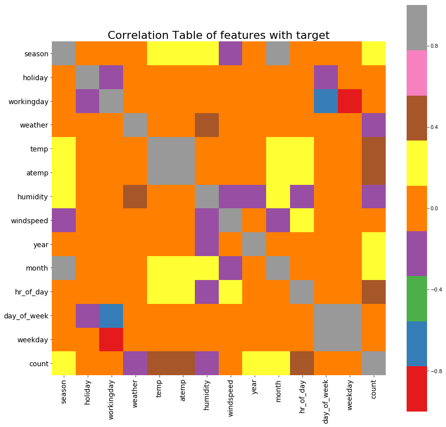


```python
## Remove variable with near-zero correlation to count, and resolve multilinearity
training = training.drop(['season', 'holiday', 'workingday','temp', 'windspeed','day_of_week'], 1)
val = val.drop(['season', 'holiday', 'workingday','temp', 'windspeed','day_of_week'], 1)
test = test.drop(['season', 'holiday', 'workingday','temp', 'windspeed','day_of_week'], 1)

```


```python
## Define the x and y variables
training_X = training.drop('count', 1)
training_y = training['count']
val_X = val.drop('count', 1)
val_y = val['count']
test_X = test.drop('count', 1)
test_y = test['count']

## merge training and val dataset as developmental dataset
dev_X = training_X.append(val_X).reset_index(drop=True)
dev_y = training_y.append(val_y).reset_index(drop=True)
```

### Model building plan

A variety of prediction models will be built using different algorithims. Then I will pick the most ideal model based on factors such as: low root mean squared error, and its ability to generalize to new data.

For all the prediction models to be built, I will use the development dataset to train the models, and tune their hyper-parameters. When I feel the models are as good as can be, with low prediction error, and not overfit. Then I will plot learning curves to check for high bias or high variance.

### Linear Regression Model

I decided to start with a simple linear regression model, however it underfit the training data. So, I moved on to more complicated algorithms.


```python
## Linear Regression Model
lr = LinearRegression()
lr.fit(training_X, training_y)
pred_train = lr.predict(training_X)
RMSE_train = mean_squared_error(training_y, pred_train)**0.5
pred_val = lr.predict(val_X)
RMSE_val = mean_squared_error(val_y, pred_val)**0.5

print('RMSE on training set: %0.3g' %RMSE_train)
print('RMSE on validation set: %0.3g' %RMSE_val)
```

    RMSE on training set: 140
    RMSE on validation set: 140


```python
## Learning curve for linear regression model
def learning_curve_LR():
    lr = LinearRegression()
    
    ## use development set to train
    X_train = dev_X
    y_train = dev_y
    X_test = test_X
    y_test = test_y
    
    
    index = [10, 500, 2000, 4000, 7452]
   
 
    curve_data = pd.DataFrame(columns = ['number of training examples', 'training RMSE', 'testing RMSE'])
    
    no_of_training_examples = [] 
    training_RMSE = []
    testing_RMSE = []
    
    for i in range(len(index)):
        ## randomly pick observations for training
        random.seed(12)
        ind = random.sample(range(0,len(X_train)), index[i])
        
        new_X_train = dev_X.loc[ind]
        
        new_y_train = dev_y.loc[ind]
        
     
   
        ## fit to training examples 
        no_of_training_examples.append(index[i])
        lr.fit(new_X_train, new_y_train)
        y_train_pred = lr.predict(new_X_train)
        ## RMSE on training examples
        train_RMSE = mean_squared_error(new_y_train, y_train_pred)**0.5
        training_RMSE.append(train_RMSE)
        
    
        ## use fit to predict testing set
        y_test_pred = lr.predict(X_test)
        ## RMSE on testing set
        test_RMSE = mean_squared_error(y_test, y_test_pred)**0.5
        testing_RMSE.append(test_RMSE)
        
    
    ## data for learning curve
    curve_data['no of training examples'] = index
    curve_data['training error'] = training_RMSE
    curve_data['testing error'] = testing_RMSE
    
    ## plot learning curve
    plt.figure(figsize = (10, 8))
    plt.title("Linear Regression", fontsize = 20)
    
    # plot the average training and test score lines at each training set size
    plt.plot(curve_data['no of training examples'], curve_data['training error'], 'o-', color="r", label="Training")
    plt.plot(curve_data['no of training examples'], curve_data['testing error'], 'o-', color="g", label="Testing")
    plt.legend(loc='upper right', fontsize = 20)
    plt.xlabel("Training examples", fontsize = 14)
    plt.ylabel("RMSE", fontsize = 14)
    
    
    # box-like grid
    plt.grid()
    
    return plt.show()

learning_curve_LR()
```


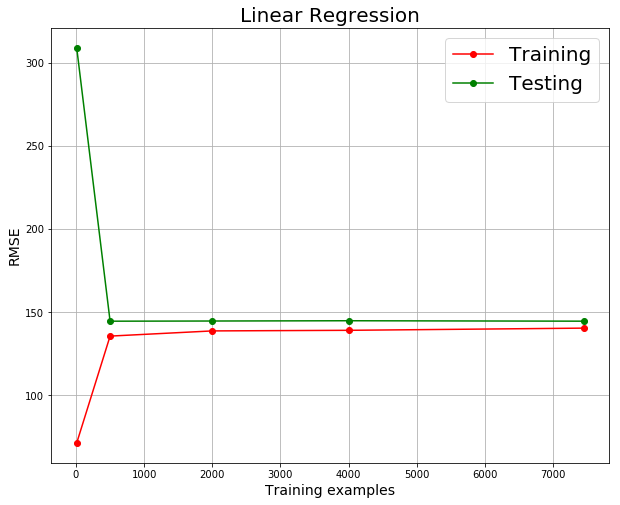


### Gradient Boosting Regression Model

#### Model Accuracy


```python
## Gradient Boosting Regression Model
GBR = GradientBoostingRegressor(loss='ls', learning_rate=0.05, n_estimators=200, max_depth=4, random_state=12)
GBR.fit(training_X, training_y)
pred_train = GBR.predict(training_X)
RMSE_train = mean_squared_error(training_y, pred_train)**0.5
pred_val = GBR.predict(val_X)
RMSE_val = mean_squared_error(val_y, pred_val)**0.5

print('RMSE on training set: %0.3g' %RMSE_train)
print('RMSE on validation set: %0.3g' %RMSE_val)
```

    RMSE on training set: 51.2
    RMSE on validation set: 54


```python
## Learning curve for gradient boosting regression model
def learning_curve_GBR():
    GBR = GradientBoostingRegressor(loss='ls', learning_rate=0.05, n_estimators=200, max_depth=4, random_state=12)

    
    ## use development set to train
    X_train = dev_X
    y_train = dev_y
    X_test = test_X
    y_test = test_y
    
    
    index = [10, 500, 2000, 4000, 7452]
   
 
    curve_data = pd.DataFrame(columns = ['number of training examples', 'training RMSE', 'testing RMSE'])
    
    no_of_training_examples = [] 
    training_RMSE = []
    testing_RMSE = []
    
    for i in range(len(index)):
        ## randomly pick observations for training
        random.seed(12)
        ind = random.sample(range(0,len(X_train)), index[i])
        
        new_X_train = dev_X.loc[ind]
        
        new_y_train = dev_y.loc[ind]
        
     
   
        ## fit to training examples 
        no_of_training_examples.append(index[i])
        GBR.fit(new_X_train, new_y_train)
        y_train_pred = GBR.predict(new_X_train)
        ## RMSE on training examples
        train_RMSE = mean_squared_error(new_y_train, y_train_pred)**0.5
        training_RMSE.append(train_RMSE)
        
    
        ## use fit to predict testing set
        y_test_pred = GBR.predict(X_test)
        ## RMSE on testing set
        test_RMSE = mean_squared_error(y_test, y_test_pred)**0.5
        testing_RMSE.append(test_RMSE)
        
    
    ## data for learning curve
    curve_data['no of training examples'] = index
    curve_data['training error'] = training_RMSE
    curve_data['testing error'] = testing_RMSE
    
    ## plot learning curve
    plt.figure(figsize = (10, 8))
    plt.title("Gradient Boosting Regression", fontsize = 20)
    
    # plot the average training and test score lines at each training set size
    plt.plot(curve_data['no of training examples'], curve_data['training error'], 'o-', color="r", label="Training")
    plt.plot(curve_data['no of training examples'], curve_data['testing error'], 'o-', color="g", label="Testing")
    plt.legend(loc='upper right', fontsize = 20)
    plt.xlabel("Training examples", fontsize = 14)
    plt.ylabel("RMSE", fontsize = 14)
    plt.ylim(-10, 190)
    
    # box-like grid
    plt.grid()
    
    return plt.show()

learning_curve_GBR()
```


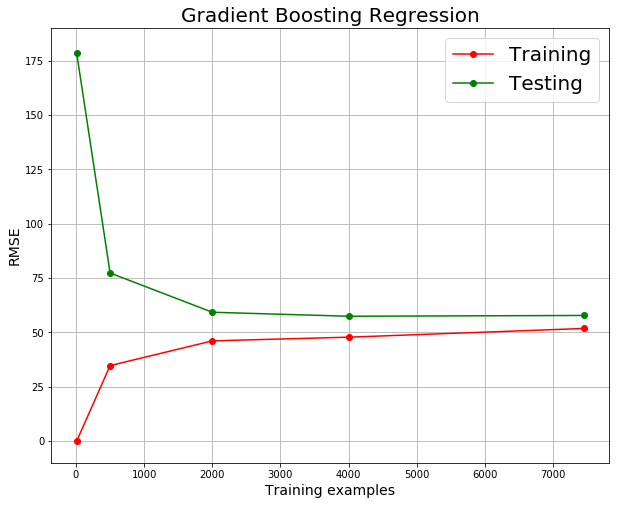


### Decision Tree Regression Model

#### Model Accuracy


```python
## Decision Tree Regression Model
DTR = DecisionTreeRegressor(criterion='mse', splitter='best', max_depth = 8, random_state = 12)
DTR.fit(training_X, training_y)
pred_train = DTR.predict(training_X)
RMSE_train = mean_squared_error(training_y, pred_train)**0.5
pred_val = DTR.predict(val_X)
RMSE_val = mean_squared_error(val_y, pred_val)**0.5

print('RMSE on training set: %0.3g' %RMSE_train)
print('RMSE on validation set: %0.3g' %RMSE_val)
```

    RMSE on training set: 71.5
    RMSE on validation set: 74.2


```python
## Learning curve for decision tree regression model
def learning_curve_DTR():
    DTR = DecisionTreeRegressor(criterion='mse', splitter='best', max_depth = 8, random_state = 12)

    
    ## use development set to train
    X_train = dev_X
    y_train = dev_y
    X_test = test_X
    y_test = test_y
    
    
    index = [10, 500, 2000, 4000, 7452]
   
 
    curve_data = pd.DataFrame(columns = ['number of training examples', 'training RMSE', 'testing RMSE'])
    
    no_of_training_examples = [] 
    training_RMSE = []
    testing_RMSE = []
    
    for i in range(len(index)):
        ## randomly pick observations for training
        random.seed(12)
        ind = random.sample(range(0,len(X_train)), index[i])
        
        new_X_train = dev_X.loc[ind]
        
        new_y_train = dev_y.loc[ind]
        
     
   
        ## fit to training examples 
        no_of_training_examples.append(index[i])
        DTR.fit(new_X_train, new_y_train)
        y_train_pred = DTR.predict(new_X_train)
        ## RMSE on training examples
        train_RMSE = mean_squared_error(new_y_train, y_train_pred)**0.5
        training_RMSE.append(train_RMSE)
        
    
        ## use fit to predict testing set
        y_test_pred = DTR.predict(X_test)
        ## RMSE on testing set
        test_RMSE = mean_squared_error(y_test, y_test_pred)**0.5
        testing_RMSE.append(test_RMSE)
        
    
    ## data for learning curve
    curve_data['no of training examples'] = index
    curve_data['training error'] = training_RMSE
    curve_data['testing error'] = testing_RMSE
    
    ## plot learning curve
    plt.figure(figsize = (10, 8))
    plt.title("Decision Tree Regression", fontsize = 20)
    
    # plot the average training and test score lines at each training set size
    plt.plot(curve_data['no of training examples'], curve_data['training error'], 'o-', color="r", label="Training")
    plt.plot(curve_data['no of training examples'], curve_data['testing error'], 'o-', color="g", label="Testing")
    plt.legend(loc='upper right', fontsize = 20)
    plt.xlabel("Training examples", fontsize = 14)
    plt.ylabel("RMSE", fontsize = 14)
    plt.ylim(-10, 190)
    
    # box-like grid
    plt.grid()
    
    return plt.show()

learning_curve_DTR()
```


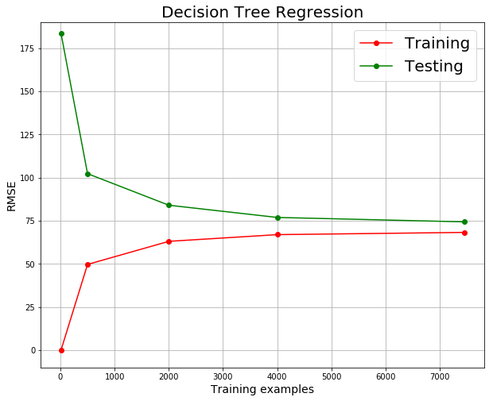


### Random Forest Model

#### Model Accuracy


```python
## Random Forest Model
RF = RandomForestRegressor(n_estimators = 100, max_depth = 8, random_state = 12)
RF.fit(training_X, training_y)
pred_train = RF.predict(training_X)
RMSE_train = mean_squared_error(training_y, pred_train)**0.5
pred_val = RF.predict(val_X)
RMSE_val = mean_squared_error(val_y, pred_val)**0.5

print('RMSE on training set: %0.3g' %RMSE_train)
print('RMSE on validation set: %0.3g' %RMSE_val)
```

    RMSE on training set: 60.8
    RMSE on validation set: 61.7


```python
## Learning curve for decision tree regression model
def learning_curve_RF():
    RF = RandomForestRegressor(n_estimators = 100, max_depth = 8, random_state = 12)

    
    ## use development set to train
    X_train = dev_X
    y_train = dev_y
    X_test = test_X
    y_test = test_y
    
    
    index = [100, 500, 2000, 4000, 7452]
   
 
    curve_data = pd.DataFrame(columns = ['number of training examples', 'training RMSE', 'testing RMSE'])
    
    no_of_training_examples = [] 
    training_RMSE = []
    testing_RMSE = []
    
    for i in range(len(index)):
        ## randomly pick observations for training
        random.seed(12)
        ind = random.sample(range(0,len(X_train)), index[i])
        
        new_X_train = dev_X.loc[ind]
        
        new_y_train = dev_y.loc[ind]
        
     
   
        ## fit to training examples 
        no_of_training_examples.append(index[i])
        RF.fit(new_X_train, new_y_train)
        y_train_pred = RF.predict(new_X_train)
        ## RMSE on training examples
        train_RMSE = mean_squared_error(new_y_train, y_train_pred)**0.5
        training_RMSE.append(train_RMSE)
        
    
        ## use fit to predict testing set
        y_test_pred = RF.predict(X_test)
        ## RMSE on testing set
        test_RMSE = mean_squared_error(y_test, y_test_pred)**0.5
        testing_RMSE.append(test_RMSE)
        
    
    ## data for learning curve
    curve_data['no of training examples'] = index
    curve_data['training error'] = training_RMSE
    curve_data['testing error'] = testing_RMSE
    
    ## plot learning curve
    plt.figure(figsize = (10, 8))
    plt.title("Random Forest Model", fontsize = 20)
    
    # plot the average training and test score lines at each training set size
    plt.plot(curve_data['no of training examples'], curve_data['training error'], 'o-', color="r", label="Training")
    plt.plot(curve_data['no of training examples'], curve_data['testing error'], 'o-', color="g", label="Testing")
    plt.legend(loc='upper right', fontsize = 20)
    plt.xlabel("Training examples", fontsize = 14)
    plt.ylabel("RMSE", fontsize = 14)
    plt.ylim(-10, 190)
    
    # box-like grid
    plt.grid()
    
    return plt.show()

learning_curve_RF()
```


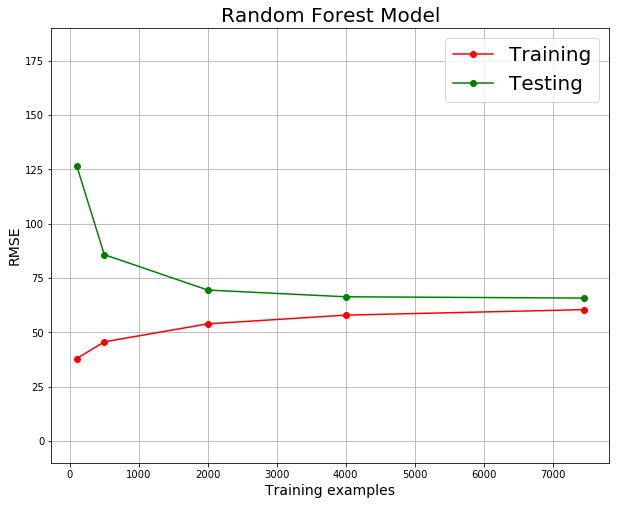


In summary, I have built three good prediction models:
    - GBR = Gradient Boosting Regression Model
    - DTR = Decision Tree Regression Model
    - RF = Random Forest Model
    

## Model Selection

With the 3 models, I feel I have a good selection of algorithims to choose from. My choice of the ideal model was based on the conditions of lower RMSE and better estimation of out-of-sample error. 

To compared the performance of the three models I made a plot of RMSE in testing set vs. RMSE in training set. The closer the point is to the diagonal, the better the model is at estimating out-of-sample error. Based on the model comparison plot below, the GBR model has the lowest RMSE. Both the GBR and RF models have the slightly better out-of-sample error than the DTR model. 

Comparing the summary statistics of the predicted counts, I can see that the GBR model predicts negative count. Since it is not possible to have negative number of bicycle rental, I have forced all negative predictions to zero, with no significant effect on the RMSE. 

Based on the predictive performance of the GBR model compared to the others, I chose the GBR model as the prediction model for this project.


```python
## RMSE of Gradient Boosting Regression Model
GBR_y_train_pred = GBR.predict(dev_X)
GBR_y_test_pred = GBR.predict(test_X)

a = mean_squared_error(dev_y, GBR_y_train_pred)**0.5
b = mean_squared_error(test_y, GBR_y_test_pred)**0.5


## RMSE of Decision Tree Regression Model
DTR_y_train_pred = DTR.predict(dev_X)
DTR_y_test_pred = DTR.predict(test_X)

c = mean_squared_error(dev_y, DTR_y_train_pred)**0.5
d = mean_squared_error(test_y, DTR_y_test_pred)**0.5


## RMSE of Random Forest Model
RF_y_train_pred = RF.predict(dev_X)
RF_y_test_pred = RF.predict(test_X)

e = mean_squared_error(dev_y, RF_y_train_pred)**0.5
f = mean_squared_error(test_y, RF_y_test_pred)**0.5


RMSE_Summary = pd.DataFrame([['Gradient Boosting Regression Model',a,b],['Decision Tree Regression Model',c,d],['Random Forest Model',e,f]], columns = ('Model', 'RMSE in Training Set','RMSE in Testing Set'))
```


```python
## plot comparing the RMSE of the different models
fig, ax = plt.subplots(figsize = (10,6))
ax.scatter(RMSE_Summary['RMSE in Training Set'], RMSE_Summary['RMSE in Testing Set'])
ax.plot((40, 80), (40, 80), ls = "--", c="black")

ax.set_xlabel('RMSE in Training Set', fontsize =16)
ax.set_ylabel('RMSE in Testing Set', fontsize =16)
ax.set_title('MODEL COMPARISON PLOT', fontsize =20)

plt.text(47,56, 'GBR model', fontsize = 12)
plt.text(56,66, 'RF model', fontsize = 12)
plt.text(66,78, 'DTR model', fontsize = 12)
plt.xticks(fontsize=14)
plt.yticks(fontsize=14)

plt.show()
```


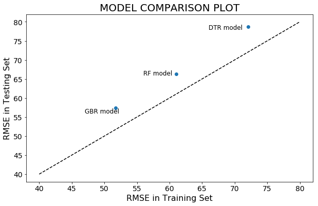


### SUMMARY STATISTICS COMPARING BICYCLE RENTAL COUNT PREDICTION ON TRAINING SET OF ALL THE MODELS WITH ACTUAL COUNT


```python
## summary statistics comparing the models prediction to the truth
GBR_summary = pd.DataFrame(GBR_y_train_pred).describe()
DTR_summary = pd.DataFrame(DTR_y_train_pred).describe()
RF_summary = pd.DataFrame(RF_y_train_pred).describe()

summary = pd.DataFrame(dev_y.describe())
summary['GBR'] = GBR_summary
summary['DTR'] = DTR_summary
summary['RF'] = RF_summary

print(summary)
```

                 count          GBR          DTR           RF
    count  7452.000000  7452.000000  7452.000000  7452.000000
    mean    189.274960   189.463682   189.791436   189.841254
    std     179.950725   163.882348   165.486172   160.487184
    min       1.000000   -74.224499     1.000000     2.527102
    25%      41.000000    41.036251    51.000000    54.365429
    50%     142.000000   159.276910   164.580645   167.715058
    75%     282.000000   294.816710   280.572917   279.130232
    max     977.000000   784.523048   708.546154   703.502043


### REVISED SUMMARY STATISTICS  AFTER FORCING ALL NEGATIVE COUNTS PREDICTIONS TO ZERO 


```python
## make all negative count values equal zero
GBR_y_train_pred[GBR_y_train_pred < 0] = 0
GBR_y_test_pred[GBR_y_test_pred < 0] = 0

GBR_summary = pd.DataFrame(GBR_y_train_pred).describe()
DTR_summary = pd.DataFrame(DTR_y_train_pred).describe()
RF_summary = pd.DataFrame(RF_y_train_pred).describe()

summary = pd.DataFrame(dev_y.describe())
summary['GBR'] = GBR_summary
summary['DTR'] = DTR_summary
summary['RF'] = RF_summary

print(summary)
```

                 count          GBR          DTR           RF
    count  7452.000000  7452.000000  7452.000000  7452.000000
    mean    189.274960   189.686195   189.791436   189.841254
    std     179.950725   163.610945   165.486172   160.487184
    min       1.000000     0.000000     1.000000     2.527102
    25%      41.000000    41.036251    51.000000    54.365429
    50%     142.000000   159.276910   164.580645   167.715058
    75%     282.000000   294.816710   280.572917   279.130232
    max     977.000000   784.523048   708.546154   703.502043


```python
## RMSE of Gradient Boosting Regression Model
a = mean_squared_error(dev_y, GBR_y_train_pred)**0.5
b = mean_squared_error(test_y, GBR_y_test_pred)**0.5

## RMSE of Decision Tree Regression Model
c = mean_squared_error(dev_y, DTR_y_train_pred)**0.5
d = mean_squared_error(test_y, DTR_y_test_pred)**0.5

## RMSE of Random Forest Model
e = mean_squared_error(dev_y, RF_y_train_pred)**0.5
f = mean_squared_error(test_y, RF_y_test_pred)**0.5


RMSE_Summary = pd.DataFrame([['Gradient Boosting Regression Model',a,b],['Decision Tree Regression Model',c,d],['Random Forest Model',e,f]], columns = ('Model', 'RMSE in Training Set','RMSE in Testing Set'))


fig, ax = plt.subplots(figsize = (10,6))
ax.scatter(RMSE_Summary['RMSE in Training Set'], RMSE_Summary['RMSE in Testing Set'])
ax.plot((40, 80), (40, 80), ls = "--", c="black")

ax.set_xlabel('RMSE in Training Set', fontsize = 16)
ax.set_ylabel('RMSE in Testing Set', fontsize = 16)
ax.set_title('REVISED MODEL COMPARISON PLOT \n AFTER FORCING ALL NEGATIVE COUNT PREDICTIONS TO ZERO', fontsize = 20)

plt.text(47,56, 'GBR model', fontsize = 12)
plt.text(56,66, 'RF model', fontsize = 12)
plt.text(66,78, 'DTR model', fontsize = 12)
plt.xticks(fontsize=14)
plt.yticks(fontsize=14)

plt.show()
```


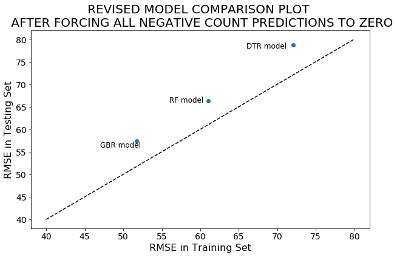


## Metrics

Below are the predictors in descending order of importance:


```python
predictors = training_X.columns.values.tolist()
feature_importance = pd.Series(GBR.feature_importances_, index=predictors).sort_values(ascending=False)
print(feature_importance)
```

    hr_of_day    0.432509
    weekday      0.207758
    atemp        0.093835
    humidity     0.091668
    month        0.079676
    year         0.064998
    weather      0.029554
    dtype: float64


The table below summarizes the estimated out-of-sample errors and other metrics for the predictive model.


```python
## Root mean square logrithimic Error
log_ypred = np.log(GBR_y_test_pred + 1)
log_ytrue = np.log(test_y + 1)
RMSLE = mean_squared_error(log_ytrue, log_ypred)**0.5

## Explained Variance Score
EVS = explained_variance_score(test_y, GBR_y_test_pred)

## Mean absolute error
MAE = mean_absolute_error(test_y, GBR_y_test_pred)

## Mean squared error
MSE = mean_squared_error(test_y, GBR_y_test_pred)

## Median absolute error
Med_AE = median_absolute_error(test_y, GBR_y_test_pred)

## R2 score
R_sq = r2_score(test_y, GBR_y_test_pred) 

metrics = pd.DataFrame([['Root Mean Squared Logrithimic Error',RMSLE],['Explained Variance Score', EVS],['Mean Absolute Error',MAE],
                        ['Mean Squared Error',MSE], ['Median Absolute Error',Med_AE], ['R_squared Score',R_sq]], columns=('metrics','value'))
print(metrics)
```

                                   metrics        value
    0  Root Mean Squared Logrithimic Error     0.605683
    1             Explained Variance Score     0.902374
    2                  Mean Absolute Error    38.668650
    3                   Mean Squared Error  3295.506131
    4                Median Absolute Error    24.149182
    5                      R_squared Score     0.902246


## Conclusion

To summarize, exploratory analysis were performed on a dataset from a bicycle rental program in Washington D.C. This exploration was done with the aim to build a prediction model to forcast hourly bicycle rental count in Washington D.C., using historic usage patterns and weather data. The effect of several weather conditions such as season, temperature, and humidity, on bicycle rental were explored. In was observed that rental is higher in warmer weather conditions. Also the way count of bicycle rental varies over time periods such as year, month, weekday/weekend was explored. It was observed that on average bicycle rental count is the same on weekdays as it is on weekends, but with difference in the hourly pattern.

Three prediction models were built but the gradient boosting regression model was choosen to be the best, as it gave the lowest prediction error, and also showed a better ability to generalize to new data compared to the other models. This model resulted in an estimated out-of-sample RMSE of ~58. In order to decrease this error, and reduce the bias of the model, I would recommend including other predictive features, in addition to the weather data. For example, traffic data in the area and cost of gas, may have significant effect on bicycle rental.


```python

```
